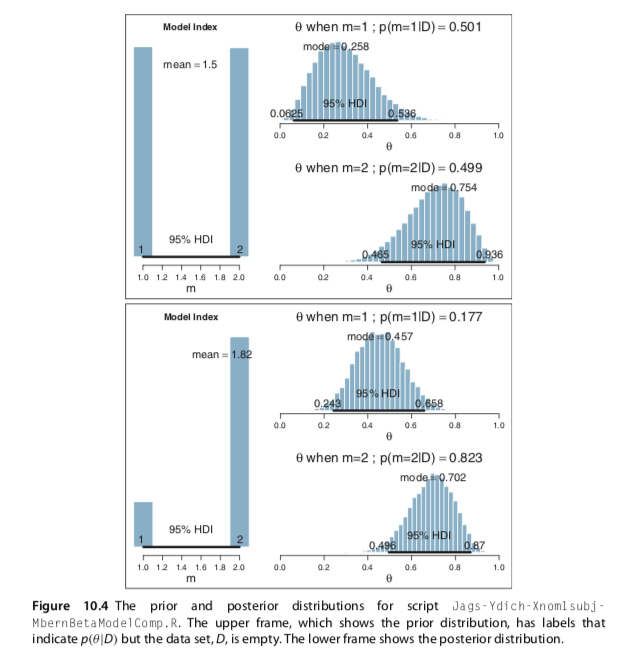
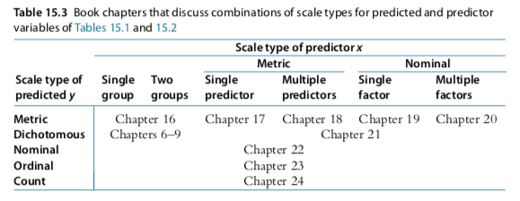

```{r setup, include=FALSE}
knitr::opts_chunk$set(echo = TRUE)
```

*Instruction*: Please type or write your answers clearly and show your work. You are encouraged to use the Rmarkdown version of this assignment as a template to submit your work. Unless stated otherwise, all programming references in the assignment will be in `R`, and the predefined `R` functions used for the problems can all be found on our Canvas site under `DBDA2Eprograms.zip`, unless specified otherwise. For this assignment, problems roughly covers content from lectures 7-9.


**Problem 1 (Modified from Exercise 10.2)** 
Consider the following simulated data

```{r,eval=FALSE}
------------------------
N=9
z=6
y = c( rep(0,N-z) , rep(1,z) )
dataList = list(
  y = y ,
  N = N 
)
------------------------
```

and the corresponding Bayesian hierarchical model

```{r,eval=FALSE}
------------------------
modelString = "
model {
  for ( i in 1:N ) {
    y[i] ~ dbern( theta )
  }
  theta ~ dbeta( omega[m]*(kappa-2)+1 , (1-omega[m])*(kappa-2)+1 ) 
  omega[1] <- .25
  omega[2] <- .75
  kappa <- 12
  m ~ dcat( mPriorProb[] )
  mPriorProb[1] <- .5
  mPriorProb[2] <- .5
}
" 
------------------------
```

a) Describe the structure of the hierarchical model and what each argument means. Outline which argument represents the likelihood function, and what is the relationship of each of the parameters in relation to how the prior is defined. Please note, the argument `dcat` represents the categorical distribution which takes a vector of probabilities for each category. JAGS does not allow the vector constants to be defined inside the argument, like this: `m ~ dcat(c(.5,.5))`, therefore it is defined as a placeholder `mPriorProb` first.

b) Use the script `Jags-Ydich-Xnom1subj-MbernBetaModelComp.R` to produce the prior and the posterior distribution of the problem above. Explain how you generated the MCMC sample from the prior. Include the graphical output in your answer, which should resemble Figure 1 below (or Figure 10.4 from the book). Note, if you got an error related to `X11 display`, try commenting out the line "`openGraph(width=7,height=5)`". 


```{r, echo=FALSE, out.width="60%", fig.cap="Sample output from the R script",fig.align='center'}

```


**Problem 2** (Exercise 11.1)


We have a six-sided die, and we want to know whether the probability that the six-dotted face comes up is fair. Thus, we are considering two possible outcomes: six-dots or not six-dots. If the die is fair, the probability of the six-dotted face is 1/6.

a) Suppose we roll the die N = 45 times, intending to stop at that number of rolls. Suppose we get 3 six-dot rolls. What is the two-tailed p value? Hint: Use Equation 11.5 (p. 303) of the book. Try the following. Explain carefully what each line of the script does. Why does it consider the low tail and not the high tail? Explain the meaning of the final result.


```{r,eval=FALSE}
N = 45 ; z = 3 ; theta = 1/6
lowTailZ = 0:z
sum( choose(N,lowTailZ) * theta^lowTailZ * (1-theta)^(N-lowTailZ) )
```


b) Suppose that instead of stopping at fixed N, we stop when we get 3 six-dot outcomes. It takes 45 rolls. (Notice this is the same result as the previous part.) What is the two-tailed p value? Hint: Use Equation 11.6 (p. 306). Try the following. Explain carefully what that code does and what its result means. Compare that with part a), what is the key difference?

```{r,eval=FALSE}
sum( (lowTailZ/N) * choose(N,lowTailZ) * thetaˆlowTailZ * (1-theta)^(N-lowTailZ) )
```


**Problem 3**

For the following examples identify the predicted variable and its scale type, identify the predictor variable(s) and its scale type, and identify what type of GLM this example belongs based on the table shown below (Figure 2 or Fig. 15.3 of the book).

a) [Hahn, Chater, and Richardson (2003)](https://pubmed.ncbi.nlm.nih.gov/12499105/) were interested in perceived similarity of simple geometric patterns. Human observers rated pairs of patterns for how similar the patterns appeared, by circling one of the digits 1–7 printed on the page, where 1 meant “very dissimilar” and 7 meant “very similar.” The authors presented a theory of perceived similarity, in which patterns are perceived to be dissimilar to the extent that it takes more geometric transformations to produce one pattern from the other. The theory specified the exact number of transformations needed to get from one pattern to the other.

b) [R. L. Berger, Boos, and Guess (1988)](https://pubmed.ncbi.nlm.nih.gov/3358985/) were interested in the longevity of rats, measured in days, as a function of the rat’s diet. One group of rats were fed freely, another group of rats had a very low calorie diet.


```{r, echo=FALSE, out.width="80%", fig.cap="Summary of types of GLM based on scale type of predictor and predicted variables",fig.align='center'}

```


